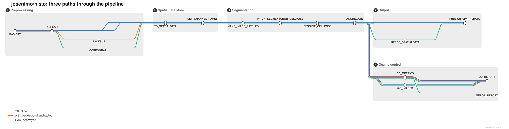

# josenimo/histo: Pipeline paths

The three routes through the pipeline that have been run on real data. Everything else in
`nextflow.config` is off by default, so these are the shapes a run actually takes.



## The same thing as a table

Read down a column to get one run's process list, in order. The three QC steps read the store
without writing to it, so they run alongside publishing rather than after it.

| Station                       |  mIF slide   | WSI, background subtracted | TMA, dearrayed |
| ----------------------------- | :----------: | :------------------------: | :------------: |
| `BASICPY`                     |      x       |             x              |       x        |
| `ASHLAR`                      |      x       |             x              |       x        |
| `BACKSUB`                     |              |             x              |    optional    |
| `COREOGRAPH`                  |              |                            |       x        |
| `TO_SPATIALDATA`              |      x       |             x              |       x        |
| `SET_CHANNEL_NAMES`           |      x       |             x              |       x        |
| `MAKE_IMAGE_PATCHES`          |      x       |             x              |       x        |
| `PATCH_SEGMENTATION_CELLPOSE` | x, per patch |        x, per patch        |  x, per patch  |
| `RESOLVE_CELLPOSE`            |      x       |             x              |       x        |
| `AGGREGATE`                   |      x       |             x              |       x        |
| `MERGE_SPATIALDATA`           |              |                            |       x        |
| `PUBLISH_SPATIALDATA`         |      x       |             x              |  x, per slide  |
| `QC_METRICS`                  |      x       |             x              |       x        |
| `QC_IMAGES`                   |      x       |             x              |       x        |
| `QC_REPORT`                   |      x       |             x              |       x        |

Everything from `COREOGRAPH` to `AGGREGATE` runs once per core on the TMA path.
`MERGE_SPATIALDATA` then puts one slide's cores back together, and `PUBLISH_SPATIALDATA`
publishes the result, so publication happens once per slide rather than once per core. The
per-core stores are not published: the merged store copies every element family and every table
out of them, prefixed by core, so publishing both would write the slide out twice.

## Regenerating the figure

The map is authored in [`pipeline_paths.mmd`](pipeline_paths.mmd) and rendered with
[nf-metro](https://github.com/seqeralabs/nf-metro):

```bash
pip install nf-metro
nf-metro validate docs/pipeline_paths.mmd
nf-metro render docs/pipeline_paths.mmd -o docs/images/pipeline_paths.svg
```

**Re-render this after any rewiring, and look at the result.** A change to the graph that leaves
the map stale is a change nobody has seen. The tests assert that processes ran and that their
outputs exist, which is not the same as checking what feeds what: sequencing `PUBLISH_SPATIALDATA`
behind `MERGE_SPATIALDATA` passed every test both before and after, and the map is where the
difference is visible. Reading it is a human step and deliberately not automated.

The station order was taken from `nextflow run . -stub -with-dag` exports of all three paths
rather than read off the source, so the map reflects the graph Nextflow actually built.
`nf-metro convert` turns such an export straight into a map, which is worth doing when the
pipeline changes shape.

Read a converted export rather than trusting it. Nextflow's DAG draws an edge per channel
consumer, so a channel that two processes read from produces edges to both even when one of them
discards part of the tuple: the WSI export shows `ASHLAR` reaching `QC_IMAGES`, which it does not,
because `subworkflows/local/qc/main.nf` drops the pre-subtraction image before `QC_IMAGES` sees
it.

nf-metro renders light only, so the figure keeps its own light surface on a dark page.

## What the map does not show

- `TISSUE_SEGMENTATION` and `FLUO_ANNOTATION` are off in all three runs. Both sit between
  `MAKE_IMAGE_PATCHES` and `AGGREGATE`.
- `use_preprocessing = false` is a fourth entry point, for images arriving pre-stitched. It
  starts at `TO_SPATIALDATA` and skips `SET_CHANNEL_NAMES`, because such an image is assumed to
  carry its own channel names.
- Supplying illumination profiles in the samplesheet bypasses `BASICPY`.
- StarDist substitutes `PATCH_SEGMENTATION_STARDIST` and `RESOLVE_STARDIST` for the two Cellpose
  stations.

One edge is deliberately absent. On the WSI line, `ASHLAR`'s pre-subtraction image also reaches
`QC_METRICS`, which is how the report compares channel statistics before and after subtraction.
It exists only when `use_backsub` is set and `use_tma_dearray` is not, because a dearrayed core
has no whole-slide before-image to compare against. Drawing it aborts nf-metro 1.1.0's renderer
with a `CurveInvariantError`, so it is written down here instead.
